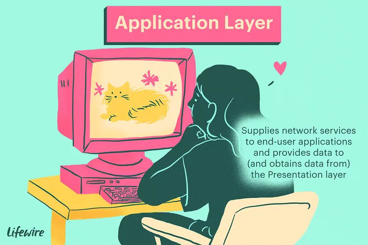
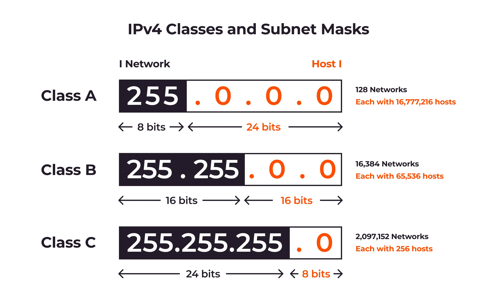
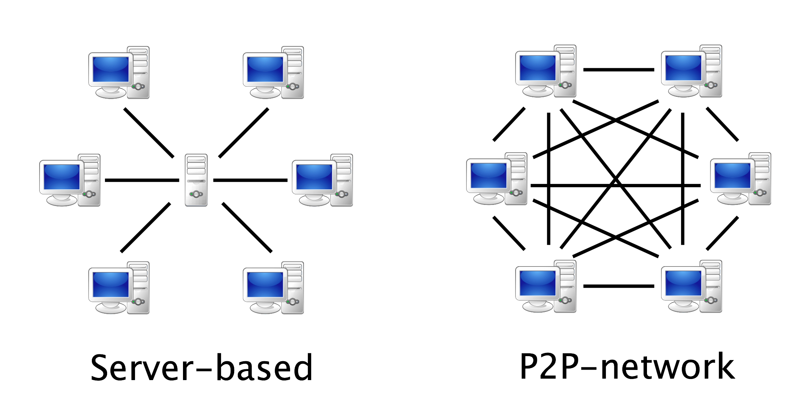

<!-- _paginate: skip -->
# Principles of Networking Computers

---

### Recap
## Complete the quiz on Teams

---

<!-- _class: learning-objectives -->
## Learning Objectives

2. Be able to use networking devices and software

2.1. Set up a simple computer network using devices which interact and operate correctly, e.g. client server or peer-to-peer.

2.2. Install computer network software to enable the creation of administrator and restricted accounts, e.g. network utility tools, network operating systems and pplication software.

2.3. Transfer stored files across a computer network using two protocols, e.g. FTP and TCP/IP.

---
## 2.1.
## Setting up a computer network

---

**2.1. Setting up a computer network**
## Key Concepts
- OSI Model
- IP Address
- Subnet
- Network Architecture

<!--  -->

---

**2.1. Setting up a computer network**
## OSI Model
The **OSI** (**Open Systems Interconnection**) Model is a framework that describes how data travels over a network.

It breaks down the process into **7 layers**, each with a specific job, like a set of rules. These layers work together to move data from one device to another.

Each layer communicates with the layer directly above and below it.

---

**2.1.** Setting up a computer network: **OSI Model Layers**

**1. Physical:** The actual hardware, like cables and switches.

---

**2.1.** Setting up a computer network: **OSI Model Layers**

**2. Data Link:** Manages data transfer between two devices.

---

**2.1.** Setting up a computer network: **OSI Model Layers**

**3. Network:** Handles routing, ensuring data gets to the right destination (e.g., IP address).

---

**2.1.** Setting up a computer network: **OSI Model Layers**

**4. Transport:** Ensures reliable data delivery.

---

**2.1.** Setting up a computer network: **OSI Model Layers**

**5. Session:** Manages the connection between two devices.

---

**2.1.** Setting up a computer network: **OSI Model Layers**

**6. Presentation:** Translates data formats (e.g., encryption).

---

**2.1.** Setting up a computer network: **OSI Model Layers**

**7. Application:** The programs or apps we use (e.g., web browsers).

---

**2.1.** Setting up a computer network: **OSI Model**

---

**2.1. Setting up a computer network**
## IP Address
An IP address is like a home address but for devices on the internet.

It’s a unique set of numbers assigned to each device (like a computer or mobile phone) to identify it on a network.

For example, `192.168.1.1` is an IP address.

---

**2.1. Setting up a computer network**
## Host & Network Segments on IP Addresses
In an IP address, there are two parts:

**Network segment:** This part identifies the broader network (like a city name).

**Host segment:** This part identifies a specific device (like a house number within that city).

For example, in the IP `192.168.1.10`, the network segment might be `192.168.1`, and the host is `.10`.

---

**2.1.** Setting up a computer network: **Host & Network Segments**

---

**2.1. Setting up a computer network**
## Private and Public IP addresses
A **public IP address** is a unique address assigned to your network by your Internet Service Provider (ISP) that allows your devices to communicate over the internet, while a **private IP address** is used within your local network to identify devices and facilitate communication among them without being visible on the internet.

---

**2.1.** Setting up a computer network: **Private and public IP addresses**

---

**2.1.** Setting up a computer network: **Private and public IP addresses**

---

**2.1. Setting up a computer network**
## Subnet
A subnet (short for sub-network) divides a larger network into smaller sections.

It helps organize devices into manageable groups and improves network efficiency.

Think of it like different neighborhoods in a city, with each neighborhood being a subnet.

---

**2.1. Setting up a computer network**
## Subnet Mask
The subnet plays a key role in dividing an IP address into **network** and **host** segments.

The subnet mask helps determine how much of the IP address is used for the **network** segment and how much is for the **host** segment.

The subnet mask is often written in a format like `255.255.255.0` or as a number after a slash, like `/24`.

---

**2.1.** Setting up a computer network: **Subnet Mask**

---

**2.1. Setting up a computer network**
## Network architecture
Network architecture refers to the design and framework of how different devices interact and share resources within a network.

---

**2.1. Setting up a computer network**
## Client-Server Network
A client-server network is a setup where a server provides resources (like files or websites), and clients (like your computer or phone) request and use those resources.

The server is like a library, and the clients are the visitors borrowing books.

---

**2.1. Setting up a computer network**
## Peer-To-Peer Network
In a peer-to-peer (P2P) network, all devices (called peers) can both provide and request resources from each other, without a central server.

It’s like a group of friends sharing files directly with each other instead of borrowing them from a library.

---

**2.1. Setting up a computer network**
## Introduction to Packet Tracer
**Cisco Packet Tracer** is a powerful _network simulation_ tool that allows users to design, visualize, and troubleshoot network topologies in a virtual environment.

It's an essential tool for network professionals, students, and educators to practice networking concepts _without the need for physical hardware_.

---

**2.1. Setting up a computer network**
## Basic Components in Packet Tracer
Packet Tracer offers a wide range of network devices to create diverse topologies.

The most fundamental components include:
- PCs (Personal Computers)
- Switches
- Routers
- Cables

---

**2.1. Setting up a computer network**
## PCs
- Represent end-user devices in a network
- Can be configured with IP addresses, gateways, and network applications
- Used to test connectivity and run simulated network services

---

**2.1. Setting up a computer network**
## Switches
- Layer 2 devices that operate at the data link layer
- Used to connect multiple devices within the same network segment
- Support VLANs and various Ethernet standards

---

**2.1. Setting up a computer network**
## Routers
- Layer 3 devices that operate at the network layer
- Used to connect different networks and route traffic between them

---

**2.1. Setting up a computer network**
## Cables

**Copper straight-through** cable is common for Ethernet connections in local networks.

**Crossover** cable is used to connect similar devices like a switch to another switch.

**Console** cable connects a computer to a router or switch for initial configuration.

---

**2.1. Setting up a computer network**
## Cables
**Fiber optic** cable is used for high-speed connections over long distances.

**Serial** cable is used to connect routers for wide area network (WAN) links.

---

**2.1. Setting up a computer network**
### Task 1

---

## 2.2.
## Install network software and manage accounts

---

**2.2. Install network software and manage accounts**
## Key Concepts
- Network Operating System
- Access Control
- Network Utility Tools

<!--  -->

---

**2.2. Install network software and manage accounts**
## Network Operating System
A network operating system is specialized software that manages communication and resource sharing between multiple devices on a network.

It allows computers, servers, printers, and other devices to connect and share files, applications, and resources across a local area network (LAN) or wider network.

---

**2.2. Install network software and manage accounts**
## Network Operating System
Key functions include:
- Enabling **communication** between devices
- Configuring and managing network **resources**
- Managing user accounts and **access control**
- Providing network **security** features

---

**2.2. Install network software and manage accounts**
## Access Control
Access permissions are rules that determine which users or groups can view, modify, or execute specific files, folders, or resources on a network. Common permission types include:

- **Read:** Allows viewing file contents
- **Write:** Enables modifying or deleting files
- **Execute:** Permits running programs or scripts

Administrators can set these permissions to control access and protect sensitive data.

---

**2.2. Install network software and manage accounts**
## Network Utility Tools
Network utility tools are software applications used to monitor, analyze, and troubleshoot network performance and connectivity.

Common examples include:

- **Ping:** Tests connectivity between devices

- **Traceroute:** Shows the path data takes across a network

- **Netstat:** Displays network connections and statistics

- **Nmap:** Scans networks for open ports and security vulnerabilities

---

**2.2. Install network software and manage accounts**
### Task 2.2
## Create Admin and User logins on a router and test network tools

---
## 2.3.
##  Transfer files using network protocols

---

**2.3. Transfer files using network protocols**
## Key Concepts
- FTP (File Transfer Protocol)
- TCP/IP File Transfer

<!--  -->

---

**2.3. Transfer files using network protocols**
## FTP (File Transfer Protocol)
File Transfer Protocol (FTP) is a standard network protocol used for transferring files between a client and a server over a TCP/IP network, such as the Internet.

Key features of FTP include:

- Uses separate control and data connections
- Allows authentication with username and password
- Supports anonymous access if configured
- Can transfer large files efficiently

---

**2.3. Transfer files using network protocols**
## FTP (File Transfer Protocol)
However, basic FTP has security limitations:

- Credentials are sent as plain text
- File transfers are not encrypted

---

**2.3. Transfer files using network protocols**
## FTP Server
An FTP server is a software application that runs on a computer and uses the File Transfer Protocol to share files with clients.

Popular FTP server software includes FileZilla Server, vsftpd, and IIS FTP server.

---

**2.3. Transfer files using network protocols**
## TCP/IP File Transfer
TCP/IP stands for **Transmission Control Protocol / Internet Protocol**.

TCP/IP File Transfer is the process of moving files between systems using the TCP/IP protocol suite.

This includes:
- FTP, which operates on top of TCP/IP
- Other protocols like SFTP (SSH File Transfer Protocol) and FTPS (FTP over SSL/TLS)
- Custom applications that use TCP sockets for file transfer

---

**2.3. Transfer files using network protocols**
## TCP/IP File Transfer
Key aspects of TCP/IP file transfer:

- Reliable data delivery through error checking and retransmission
- Flow control to prevent overwhelming the receiver
- Ability to transfer files of any size
- Support for various network types and topologies

TCP/IP file transfer allows for fine-tuned control over the transfer process and integration with other application features.

---

**2.3. Transfer files using network protocols**
## Comparing FTP and TCP/IP
**Purpose:** FTP is specifically designed for transferring files between computers, while TCP/IP is a broader protocol suite that facilitates data packet transmission across networks.

**Performance:** FTP may be slower with many small files, while TCP/IP generally provides faster transfers.

---

**2.3. Transfer files using network protocols**
## Comparing FTP and TCP/IP
**File Operations:** FTP allows for file management tasks like browsing and deleting, while TCP/IP does not handle these operations directly.

**Security:** Basic FTP lacks security features, but TCP/IP can be secured with additional protocols.

**Connections:** FTP uses two connections for control and data transfer, whereas TCP/IP typically operates over a single connection.

---

**2.3.** Transfer files using network protocols: **FPT vs TCP/IP**
| Feature            | FTP                                        | TCP/IP                                    |
|--------------------|--------------------------------------------|-------------------------------------------|
| Purpose             | Transfers files between computers          | Ensures data reaches its destination correctly        |
| Usage              | Mainly for file transfer tasks             | Used for various internet communications   |
| OSI Layer              | Application layer                          | Transport and Internet layers             |
| Connection         | Uses two connections: control and data     | Uses a single connection for data transfer |
| Ports              | Uses ports 20 and 21                      | Can use various ports, commonly 80 for HTTP |
| Security           | Basic version is not secure                | Can be secured with additional protocols  |
| File Operations    | Can browse, rename, and delete files      | Does not handle file operations directly  |
| Speed              | Can be slow for many small files          | Generally faster for multiple small transfers |
| Reliability        | Ensures complete file transfer             | Guarantees data packet delivery and order  |

<!-- >Source: [cisco.com](https://cisco.com) -->
---

**2.3. Transfer files using network protocols**
### Task 2: FTP

---

**Setting up a computer network**
### Assignment 2.1 & 2.3
## Complete the assignment task 2.1 and 2.3
Take screenshots of the process

---

### Task 3:
## Configure a VPN