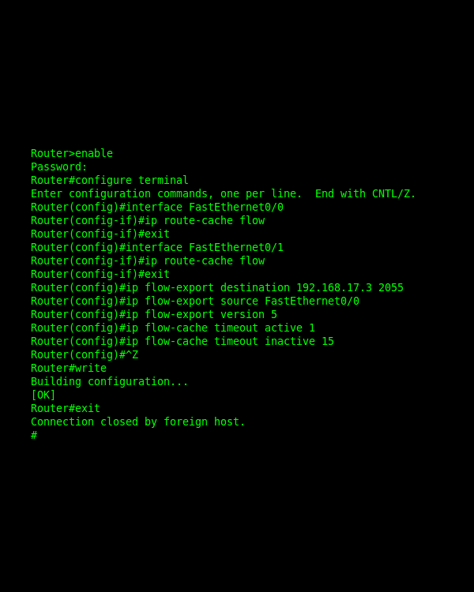

<!-- _paginate: skip -->
# Principles of Networking Computers

---

### Recap

---

<!-- _class: learning-objectives -->
## Learning Objectives

3. Understand security features and requirements for computer networks.

3.1. Describe the potential security threats computer networks may encounter, e.g. hacking, DDOS and malware.

3.2. Install and configure appropriate software/utilities which ensure a computer network is secure when in use e.g. end-to-end encryption, firewalls and anti-malware.

---
## 3.1.
## Computer network security threats

---

**3.1. Computer network security threats**
## Key Concepts
- Lorem
- Ipsum
- Dolor

---

**3.1. Computer network security threats**
## Concept
Lorem ipsum.

---

**3.1.** Computer network security threats: **Concept**

---

**3.1. Computer network security threats**
### Task

---

## 3.2.
## Install network security software

---

**3.2. Install network security software**
## Key Concepts
- Lorem
- Ipsum
- Dolor

---

**3.2. Install network security software**
## Concept
Lorem Ipsum

---

**3.2. Install network security software**
### Task
## Task description
Lorem ipsum

---

**Install network security software**
### Assignment
## Complete the assignment task
Take screenshots of the process
