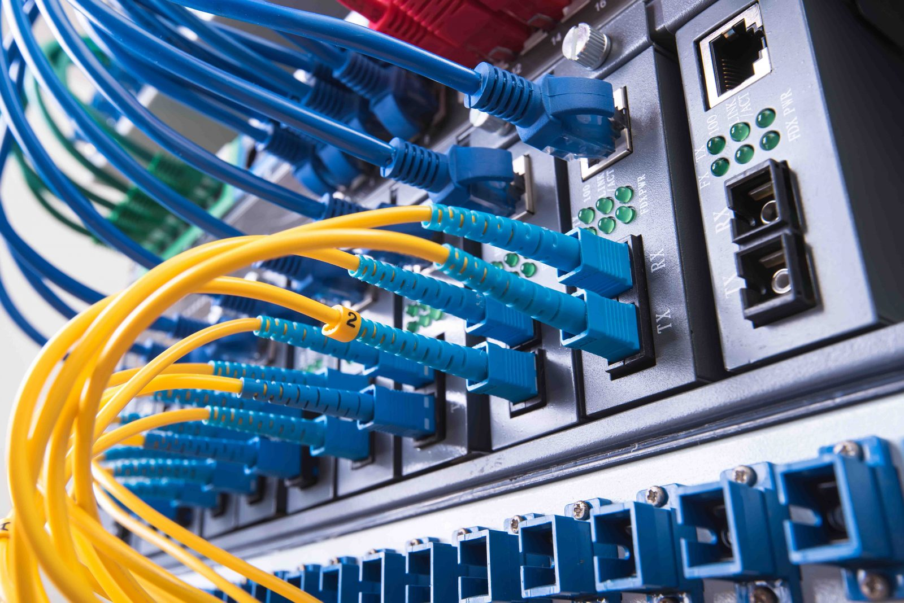

<!-- _paginate: skip -->
# Principles of Networking Computers

---

### Recap
## Quiz on Teams (15 min)

---

<!-- _class: learning-objectives -->
## Learning Objectives

3. Understand security features and requirements for computer networks.

3.1. Describe the potential security threats computer networks may encounter, e.g. hacking, DDOS and malware.

3.2. Install and configure appropriate software/utilities which ensure a computer network is secure when in use e.g. end-to-end encryption, firewalls and anti-malware.

---

## 3.1.
## Computer network security threats

---
<!--
## "Any sufficiently advanced incomeptence is indistinguishable from malice"
## - Crowdstrike, 2024

--- -->

**3.1. Computer network security threats**
## Key Concepts
- Malware
- Network Attacks
- Unauthorized Access
- Social Engineering

---

**3.1. Computer network security threats**
## Malware
- Botnets
- Spyware
- Adware
- Ransomware
- Trojans
- Worms
- Rootkits

---

**3.1. Computer network security threats**

**Malware**
## Botnets
A network of infected computers controlled by a malicious actor, often without the knowledge of the device owners. These infected devices, also known as "bots" or "zombies," are used collectively to carry out large-scale attacks, such as Distributed Denial of Service (DDoS) attacks, data theft, or spamming. Botnets are often managed through command-and-control (C&C) servers by cybercriminals to coordinate malicious activities.

**Example**: The Mirai botnet infected IoT devices to conduct massive DDoS attacks, temporarily taking down popular websites.

---

**3.1. Computer network security threats**

**Malware**
## Spyware
Software that secretly gathers information about a user's activities without their consent. Spyware can track browsing habits, record keystrokes, and capture sensitive data such as login credentials and credit card numbers. This data is then sent to third parties, often leading to identity theft or financial loss.

**Example**: Keyloggers, a type of spyware, can record everything a user types, capturing passwords and private messages.

---

**3.1. Computer network security threats**

**Malware**
## Adware
Software that automatically displays or downloads advertising material, usually without the user's consent. Adware often tracks user behavior and displays targeted ads. Although some adware is relatively harmless, it can slow down devices, create pop-ups, and pose privacy risks by sharing user data with advertisers.

**Example**: Some free software comes bundled with adware that generates pop-up ads and tracks user data for marketing purposes.

---

**3.1. Computer network security threats**

**Malware**
## Ransomware
A type of malware that encrypts files on a victim's device, rendering them inaccessible. The attacker demands a ransom, usually in cryptocurrency, for the decryption key needed to restore access to the files. Ransomware attacks can target individuals, businesses, or even government entities, often resulting in significant financial and operational damage.

**Example**: The WannaCry ransomware affected organizations worldwide, demanding payments for decrypting critical files.

---

**3.1. Computer network security threats**

**Malware**
## Trojans
Malware disguised as legitimate software that tricks users into installing it. Once installed, Trojans can open backdoors for attackers, steal data, or install additional malicious software. Unlike viruses, Trojans do not self-replicate but rely on users to install them under the belief they are safe or useful applications.

**Example**: A user downloads what appears to be an antivirus program, but it is actually a Trojan that steals sensitive data.

---

**3.1. Computer network security threats**

**Malware**
## Worms
Self-replicating malware that spreads across networks without user intervention. Worms exploit vulnerabilities in software or network protocols, allowing them to quickly infect many devices within a network. Unlike viruses, worms do not need to attach themselves to other programs to spread, making them particularly potent for large-scale network attacks.

**Example**: The Morris worm, one of the first worms to spread via the internet, affected thousands of computers in the late 1980s.

---

**3.1. Computer network security threats**

**Malware**
## Rootkits
Malware that provides unauthorized access to a computer system and conceals its presence or the presence of other malware. Rootkits can modify system files and settings, making them difficult to detect and remove. They allow attackers to maintain control over the infected system, often going unnoticed by traditional security tools.

**Example**: A rootkit may hide other malware that captures keystrokes or monitors network traffic, giving attackers a continuous presence on the compromised system.

---

**3.1. Computer network security threats**
## Network Attacks
- Distributed Denial of Service (DDoS)
- Man-in-the-Middle (MitM) attacks
- SQL injection
- DNS spoofing

---
**3.1. Computer network security threats**

**Network Attacks:**
## Distributed Denial of Service (DDoS)
A type of attack that floods a target system, such as a server, website, or network, with an overwhelming amount of traffic from multiple sources, rendering the target inaccessible to legitimate users. DDoS attacks typically involve a botnet of compromised devices controlled by the attacker, which send massive amounts of data to exhaust the target’s resources or bandwidth.

**Example**: In 2016, the Dyn DNS provider was hit by a massive DDoS attack, which impacted popular websites like Twitter, Reddit, and Netflix, making them temporarily unavailable to users.

---

**3.1. Computer network security threats**

**Network Attacks:**
## Man-in-the-Middle (MitM) attacks
An attack where the attacker secretly intercepts and possibly alters communication between two parties who believe they are communicating directly. This interception allows the attacker to capture sensitive information, such as login credentials or financial data, and potentially inject malicious content into the communication. MitM attacks are often executed in unsecured or public networks.

**Example**: An attacker intercepts data between a user and a banking website on a public Wi-Fi network, capturing login information and account details.

---

**3.1. Computer network security threats**

**Network Attacks:**
## SQL Injection
An attack that involves injecting malicious SQL code into an application’s query to manipulate the database. By exploiting vulnerabilities in input fields (e.g., login forms), attackers can bypass authentication, retrieve unauthorized data, modify data, or even delete critical information. SQL injection attacks pose a significant threat to applications that handle sensitive user data.

**Example**: An attacker inputs malicious code into a login form, bypassing authentication and gaining unauthorized access to a database of user accounts on a website.

---

**3.1. Computer network security threats**

**Network Attacks:**
## DNS Spoofing
An attack where the attacker corrupts the Domain Name System (DNS) data to redirect traffic from legitimate websites to malicious ones. By altering DNS records, attackers can reroute traffic to fraudulent sites that appear legitimate, allowing them to steal sensitive information like usernames, passwords, and financial data. DNS spoofing attacks are especially effective for phishing schemes.

**Example**: Users trying to access their bank’s website are redirected to a fake, look-alike page where attackers capture their login credentials.

---

**3.1. Computer network security threats**
## Unauthorized Access
- Hacking
- Zero-Day exploits
- Insider threats

---
**3.1. Computer network security threats**

**Unauthorized Access:**
## Hacking
The act of gaining unauthorized access to computer systems, networks, or digital assets. Hackers may use various techniques, such as exploiting software vulnerabilities, using brute force attacks, or leveraging stolen credentials to infiltrate a system. The intent of hacking can range from data theft and espionage to system disruption or financial gain.

**Example**: A hacker exploits a weak password to gain access to an organization's confidential files and downloads sensitive data.

---

**3.1. Computer network security threats**

**Unauthorized Access:**
## Zero-Day Exploits
Attacks that target previously unknown vulnerabilities in software or hardware, which have not yet been patched by the vendor. Since these vulnerabilities are unknown to the developers, they are especially dangerous, as there is no existing defense. Zero-day exploits are often highly valuable and are quickly weaponized by attackers to gain unauthorized access or control over systems.

**Example**: An attacker discovers an unreported vulnerability in a popular operating system and uses it to compromise thousands of devices before a security patch is issued.

---

**3.1. Computer network security threats**

**Unauthorized Access:**
## Insider Threats
Security risks that originate from individuals within the organization, such as employees, contractors, or partners. Insider threats may arise from malicious intent, such as theft or sabotage, or from unintentional actions, such as accidentally sharing confidential information. Insiders have an advantage due to their knowledge of internal systems, making their actions harder to detect.

**Example**: A disgruntled employee with access to sensitive customer data sells it to unauthorized third parties.

---

**3.1. Computer network security threats**

**Social Engineering**
The manipulation of people into divulging confidential information, granting access, or performing actions that compromise security. Social engineering exploits human psychology, often relying on trust, fear, or urgency. Attackers may pose as trusted entities to trick individuals into revealing sensitive data, such as passwords, or performing actions that bypass security protocols.

**Example**: A phishing email posing as a message from IT support requests that users reset their passwords on a fake website, where attackers capture their credentials.

---

**3.1. Computer network security threats**
## Impacts of Security Threats
- Data Loss
- Service Disruption
- Financial Loss
- Reputation Damage

---

**3.1. Computer network security threats**
### Assignment Part 3
## Group discussion
Carry out a group discussion where each of you selects a security threat a computer network may encounter, carry out some basic research to find a security threats as a group, and divide these among you for further exploration. Carry out some further research individually and now return back to the group to - define the security threat, explain what kind of damage could be caused and also a remedial measure to prevent it. 

---

**3.2. Install and configure network security software**

## Network Security Software and Utilities
To ensure a computer network is secure, it is essential to install and configure various software tools and utilities that protect against unauthorized access, data breaches, and malware. Key components include firewalls, anti-malware programs, and encryption utilities that enhance network security when in use.

---

**3.2. Install and configure network security software**

**Perimeter Defense**
## Firewalls
Firewalls are either software or hardware devices that monitor and control incoming and outgoing network traffic based on predetermined security rules. They act as a barrier between trusted internal networks and untrusted external networks, blocking potentially harmful traffic and preventing unauthorized access.

**Example**: Configuring firewall rules to allow only specific IP addresses to access sensitive systems in a corporate network.

---

**3.2. Install and configure network security software**

**Perimeter Defense**
## Anti-Malware
Anti-malware software is designed to detect, prevent, and remove malicious software like viruses, ransomware, spyware, and worms. Regular scans and real-time protection capabilities help prevent malware from compromising devices and the network.

**Example**: Using antivirus programs to scan for and quarantine suspicious files before they can infect the network.

---

**3.2. Install and configure network security software**

**Data Protection**
## End-to-End Encryption
End-to-end encryption is a method that secures data by encrypting it on the sender’s side and decrypting it only on the recipient’s side. This ensures that data is protected from unauthorized access while being transmitted over the network, as only authorized parties with the encryption key can read the data.

**Example**: Implementing end-to-end encryption on messaging platforms to protect users' private conversations from eavesdropping.

---

**3.2. Install and configure network security software**

**Access Management**
## Virtual Private Networks (VPNs)
VPNs create a secure, encrypted connection over a less secure network, such as the internet. VPNs help ensure that data transmitted between a device and a network is protected from unauthorized access, particularly useful for remote workers connecting to a corporate network.

**Example**: Employees use VPNs to securely access company resources from home, ensuring data remains encrypted and private.

---

**3.2. Install and configure network security software**

**Threat Detection and Response**
## Security Information and Event Management (SIEM) Systems
SIEM systems provide real-time analysis of security alerts generated by network hardware and applications. By aggregating and analyzing security data across an organization, SIEMs help identify and respond to potential security incidents before they cause harm.

**Example**: SIEM tools alert IT teams to unusual login patterns, enabling immediate action to prevent possible breaches.

---

**3.2. Install and configure network security software**
### PART 3 Practice File  Firewall Configuration
## Do a basic firewall configuration in Cisco Packet Tracer
**Assignment question 3.2.** Install and configure appropriate software/utilities which ensure a computer network is secure when in use e.g. end-to-end encryption, firewalls and anti-malware. 

---

### Assignment
## Finish the assignment document on Teams