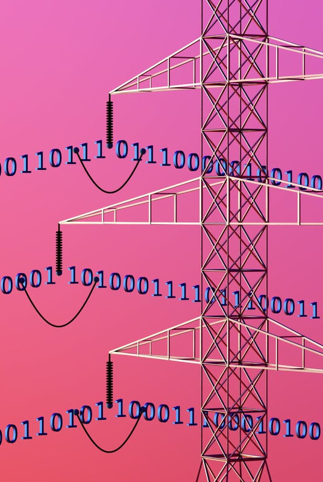
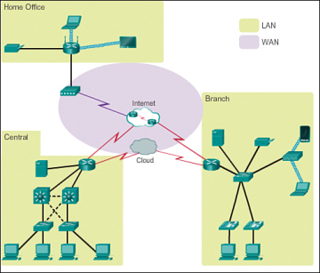
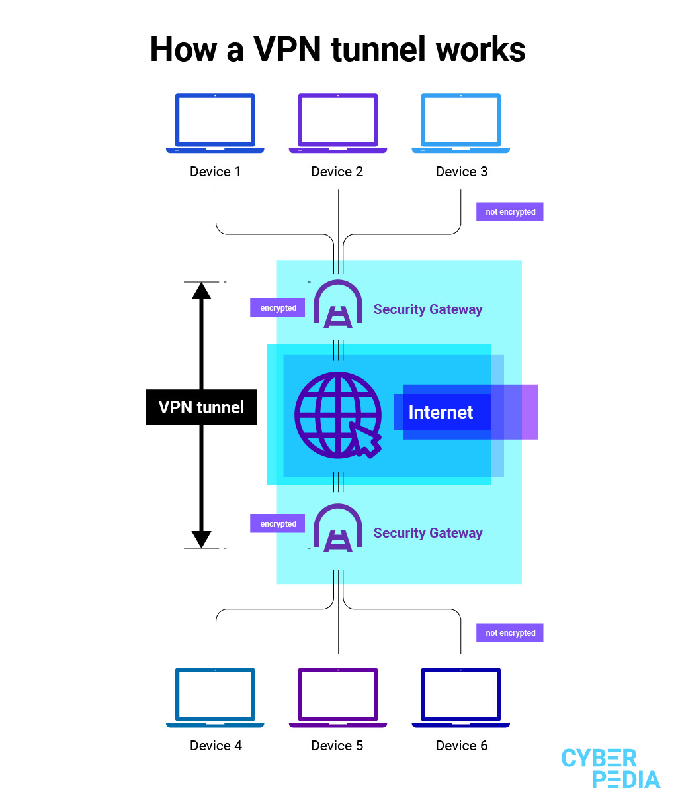
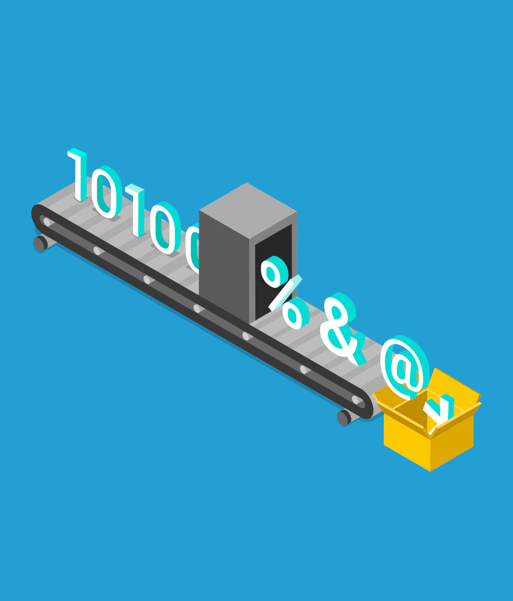
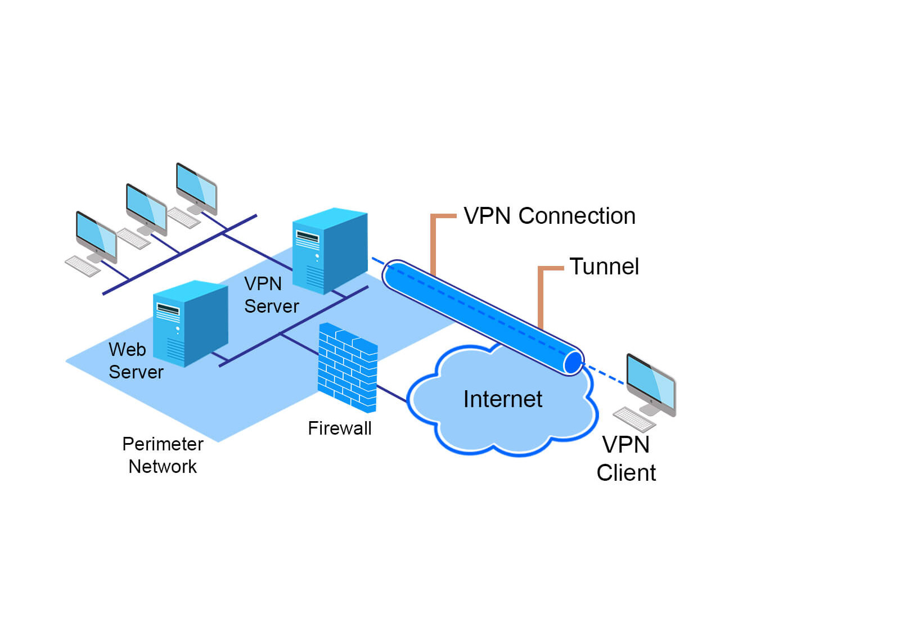
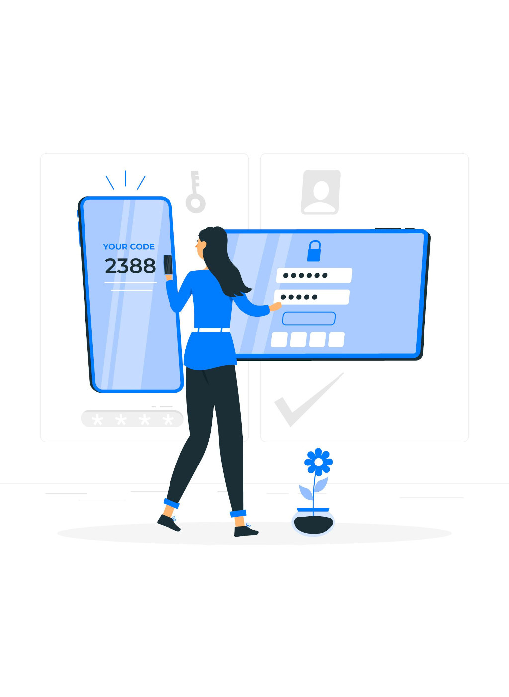
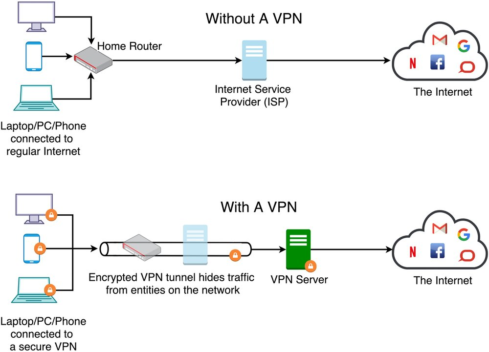
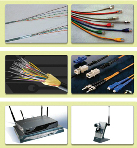

# Principles of Networking Computers 

---

## Learning Objectives

**1.** Understand the principles of **networking computers** and the associated benefits and disadvantages.
**1.1.** Identify different computer networks and explain their uses e.g. **WAN**, **LAN**, **WLAN** and **MAN**.
**1.2.** Describe how a **VPN** works and the benefits they afford businesses.
**1.3.** Explain the advantages and disadvantages of **wired** and **wireless**, e.g. security, flexibility and BYOD (Bring Your Own Device)

---

### Starter activity
## Guess the type of network

1. **"I am a network that spans a small, local area, like an office or a school."**
Hint: I’m the most common type of network found in homes and small businesses.

**What am I?**

a) Local Area Network 
b) Metropolitan Area Network
c) Personal Area Network

---

## Key Concepts

- **Network**: A group of interconnected devices that share resources.
- **Topology**: The **physical** or **logical** arrangement of a network.

---

## 1.1. Identify different computer networks and explain their uses

- **Wide Area Network (WAN):** A WAN spans large geographical areas, connecting multiple smaller networks (LANs, MANs). It allows businesses to communicate across cities, countries, or even continents. The internet is the largest example of a WAN. 
  
- **Local Area Network (LAN):** A LAN is a network of devices within a small geographical area, like a home, office, or school. It enables fast, secure communication between devices, such as computers and printers. 

---

---

- **Wireless LAN (WLAN):** WLANs function like LANs but transmit data wirelessly using Wi-Fi. It is widely used in homes, businesses, and public places like cafes. Devices must be within range of a wireless access point. 

- **Metropolitan Area Network (MAN):** MANs cover larger areas than LANs, such as cities or campuses, connecting multiple LANs. They are typically used by universities or large organizations.

---

- **Personal Area Network (PAN):** A Personal Area Network (PAN) is a small network that interconnects technology devices within a limited range, typically just a few meters 2. It enables devices in a small office or home office (SOHO) environment to communicate and share resources, data, and applications 2.

> https://www.ciscopress.com/articles/article.asp?p=2158215&seqNum=6

---

### Task 1 
**Complete Assignment Question 1.1 Part 1A written description** 

---

## 1.2. How a VPN works and the benefits they afford businesses

---

**1.2. Key Concept:**

## Encryption

Encryption is the process of converting plaintext (readable data) into ciphertext (unreadable data) using an algorithm and a secret key, with the goal of protecting the confidentiality and integrity of the data

---

**1.2. Key Concept:**

## Tunneling

VPNs use tunneling protocols to encapsulate the data in encrypted packets, securely transporting it across the internet.

---

**1.2. Key Concept:**

## Authentication

Before any data transmission, VPNs ensure that both the server and the client authenticate each other’s identity, often using passwords or certificates.
  

---

**1.2. Key Concept:**

## Virtual Private Network (VPN)

A VPN creates a secure, encrypted connection over a public network like the internet. By tunneling data and using encryption protocols, VPNs provide businesses with secure access to internal resources from remote locations. This is essential for remote work and safeguarding sensitive business data.

---

---

## Technologies Involved

1. **IPsec (Internet Protocol Security)**:
   - IPsec is a suite of protocols that provide security by authenticating and encrypting IP packets between devices.
   - **Transport and Tunnel Modes**: IPsec can operate in two modes:
     - *Transport mode*: Encrypts only the payload of the IP packet.
     - *Tunnel mode*: Encrypts the entire IP packet, providing more robust security.

---

## Technologies Involved

2. **SSL (Secure Sockets Layer)**:
   - SSL-based VPNs are also widely used. They allow users to connect using their web browser without needing specific VPN software.
   - **SSL VPN** ensures encrypted connections between users and applications on the network, typically through secure web browsers.

--- 

## Technologies Involved

3. **Authentication Mechanisms**:
   - Common methods include multi-factor authentication (MFA), certificates, and digital tokens to ensure that the correct individuals are accessing the network.
   
4. **Encryption Protocols**:
   - VPNs rely on encryption standards like **AES-256** to secure data.
   
5. **VPN Clients**:
   - Users need a VPN client installed on their device (such as Cisco AnyConnect) to establish and manage VPN connections securely.

---

## How Remote Access VPN Works

1. **Initiation**: The user’s device (laptop, smartphone, etc.) initiates a connection to the corporate network via a VPN client.
2. **Encryption & Authentication**: The VPN client encrypts data before sending it over the internet to the VPN server. The server, in turn, authenticates the client using passwords, digital certificates, or other methods.
3. **Tunnel Creation**: Once authenticated, a secure tunnel is established between the user’s device and the VPN server. Data is securely transported through this tunnel, preventing external threats from accessing it.
4. **Accessing Network Resources**: The user now has remote access to company resources (files, applications, internal systems) as though they were directly connected to the office network.

---

## Types of Remote Access VPNs

1. **IPsec VPN**:
   - Requires a VPN client and provides strong encryption and security.
2. **SSL VPN**:
   - Can be accessed through web browsers, offering flexibility for accessing corporate applications.

---

## Key VPN Benefits for Businesses

- **Security**: VPNs ensure data confidentiality by encrypting communication between remote users and company resources.
- **Remote Access**: Employees can securely access the business network from anywhere, which enhances productivity.
- **Cost-effective**: VPNs eliminate the need for expensive leased lines by using the public internet securely. 

> [Source: Cisco VPN Overview](https://www.cisco.com)

---

### Task 2 

**Complete Assignment Question 1.2 Part 1B written question and answer** 

---

## 1.3. Advantages and disadvantages of wired networks and wireless networks

---

## 1.3. Key Concepts

- **WPA2/WPA3**: Wireless security protocols that encrypt data to secure wireless communications.
- **Bandwidth**: The maximum rate of data transfer across a network.
- **Ethernet**: The standard technology used for wired networks.
- **Latency**: The delay before a transfer of data begins following an instruction.

---

### Wired vs. Wireless Debate

**Group 1: Advocates for Wired Networks**

**Group 2: Supporters of Wireless Networks**

- Each group will be provided with a set of advantages and disadvantages of their assigned network type (next slides).
- Use these points as a basis to prepare your arguments:
    - Key benefits of the network type.
    - Potential drawbacks.

Feel free to include real-life examples or scenarios where your network type excels or faces challenges.

---
## 1.3. Wireless Networks: WLAN

| **Advantages**       | **Disadvantages**      |
|----------------------|------------------------|
| **Flexibility**: Devices can connect without physical cables, allowing for greater mobility and convenience. | **Security**: More vulnerable to unauthorized access and attacks without proper encryption (WPA2/3). |
| **Mobility**: Ideal for mobile devices like laptops and smartphones, providing network access anywhere within range of the Wi-Fi signal. | **Interference**: Signal degradation can occur due to physical obstructions, electronic interference, or network congestion. |

---

## 1.3. Wireless Networks: WLAN

| **Advantages**       | **Disadvantages**      |
|----------------------|------------------------|
| **Scalability**: Easy to add new devices and expand the network without needing to rewire or install additional hardware. | **Reliability**: Susceptible to outages and performance issues due to interference, environmental factors, and device congestion. |
| **Cost-Effective**: Less expensive to set up in environments that don’t require extensive infrastructure, such as office buildings. | **Speed**: Typically slower compared to wired networks, especially under high user loads. Wi-Fi speeds can fluctuate based on distance from the access point. |

---

## 1.3. Wireless Networks: WLAN

| **Advantages**       | **Disadvantages**      |
|----------------------|------------------------|
| **Ease of Installation**: Simple to install without needing physical cabling, making it easy to deploy in both new and existing buildings. | **Bandwidth Sharing**: Wireless networks share bandwidth between devices, which can reduce overall performance as more devices connect. |

---

## 1.3. Wired Networks: Ethernet

| **Advantages**       | **Disadvantages**      |
|----------------------|------------------------|
| **Security**: More secure due to physical connections, making them less susceptible to hacking. | **Flexibility**: Limited to fixed locations; not ideal for mobile devices. |
| **Speed**: Generally faster and more reliable, with less interference and latency. | **Installation**: Requires physical cables, which can be complex and expensive to install. |

---

## 1.3. Wired Networks: Ethernet
| **Advantages**       | **Disadvantages**      |
|----------------------|------------------------|
| **Reliability**: More consistent and reliable performance with minimal downtime and fewer disruptions from external factors. | **Scalability**: Can be difficult and costly to scale, as adding new devices or expanding the network requires additional cabling and hardware infrastructure. |
| **Low Interference**: Less affected by electromagnetic interference, resulting in better and more consistent network performance. | **Cost**: Higher upfront costs for cabling, switches, and labor, especially in large-scale installations. |

---

## 1.3. Wired Networks: Ethernet
| **Advantages**       | **Disadvantages**      |
|----------------------|------------------------|
| **Dedicated Bandwidth**: Each device gets its own dedicated bandwidth, preventing network slowdowns due to multiple users sharing the same connection. | **Port Limitations**: Limited by the number of available Ethernet ports on switches or routers, which can constrain network growth. |

---

### Debate
- Choose a representative for each group that will defend their network type while also addressing the points raised by the opposing group.
- Focus on providing evidence for your claims and actively responding to counterarguments.

---

### Task 3 
**Complete Assignment Question 1.3 Part 1C written description** 
