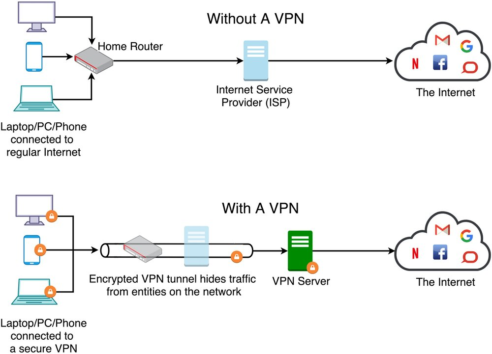

# Principles of Networking Computers 

Catalina Polanco
catalina.polanco@rhacc.ac.uk

---

## Learning Objectives

**1.** Understand the principles of networking computers and the associated benefits and disadvantages.
**1.1.** Identify different computer networks and explain their uses e.g. WAN, LAN, WLAN and MAN.
**1.2.** Describe how a VPN works and the benefits they afford businesses.
**1.3.** Explain the advantages and disadvantages of wired and wireless , e.g. security, flexibility and BYOD (Bring Your Own Device)

---
### Starter activity
## Guess the type of network

1. **"I am a network that spans a small, local area, like an office or a school."**
Hint: I’m the most common type of network found in homes and small businesses.

**What am I?**

a) Local Area Network 
b) Metropolitan Area Network
c) Personal Area Network

---
## Key Concepts

- **Network**: A group of interconnected devices that share resources.
- **Topology**: The **physical** or **logical** arrangement of a network.

---

## Identify different computer networks and explain their uses

- **Wide Area Network (WAN):** A WAN spans large geographical areas, connecting multiple smaller networks (LANs, MANs). It allows businesses to communicate across cities, countries, or even continents. The internet is the largest example of a WAN. 
  
- **Local Area Network (LAN):** A LAN is a network of devices within a small geographical area, like a home, office, or school. It enables fast, secure communication between devices, such as computers and printers. 

---

- **Wireless LAN (WLAN):** WLANs function like LANs but transmit data wirelessly using Wi-Fi. It is widely used in homes, businesses, and public places like cafes. Devices must be within range of a wireless access point. 

- **Metropolitan Area Network (MAN):** MANs cover larger areas than LANs, such as cities or campuses, connecting multiple LANs. They are typically used by universities or large organizations.

---

- **Personal Area Network (PAN):** A Personal Area Network (PAN) is a small network that interconnects technology devices within a limited range, typically just a few meters 2. It enables devices in a small office or home office (SOHO) environment to communicate and share resources, data, and applications 2.

> https://www.cisco.com

---

## Describe how a VPN works and the benefits they afford businesses

---

## Key Concepts:

- **Encryption**: Encryption is the process of converting plaintext (readable data) into ciphertext (unreadable data) using an algorithm and a secret key, with the goal of protecting the confidentiality and integrity of the data

- **Virtual Private Network (VPN):** A VPN creates a secure, encrypted connection over a public network like the internet. By tunneling data and using encryption protocols, VPNs provide businesses with secure access to internal resources from remote locations. This is essential for remote work and safeguarding sensitive business data.
  
---

---
## Key VPN Benefits for Businesses:
- **Security**: VPNs ensure data confidentiality by encrypting communication between remote users and company resources.
- **Remote Access**: Employees can securely access the business network from anywhere, which enhances productivity.
- **Cost-effective**: VPNs eliminate the need for expensive leased lines by using the public internet securely. 

> [Source: Cisco VPN Overview](https://www.cisco.com)

---

## 1.3 Advantages and disadvantages of wired network

---

## Wired Networks (Ethernet)

| **Advantages**       | **Disadvantages**      |
|----------------------|------------------------|
| **Security**: More secure due to physical connections, making them less susceptible to hacking. | **Flexibility**: Limited to fixed locations; not ideal for mobile devices. |
| **Speed**: Generally faster and more reliable, with less interference and latency. | **Installation**: Requires physical cables, which can be complex and expensive to install. |

---

## Key concepts

- **Ethernet**: The standard technology used for wired networks.

- **Latency**: The delay before a transfer of data begins following an instruction.

---

## 1.3 Explain the advantages and disadvantages of wireless networks

---

## Wireless Networks (WLAN)

| **Advantages**       | **Disadvantages**      |
|----------------------|------------------------|
| **Flexibility**: Devices can connect without physical cables, allowing for greater mobility and convenience. | **Security**: More vulnerable to unauthorized access and attacks without proper encryption (WPA2/3). |
| **Mobility**: Ideal for mobile devices like laptops and smartphones, providing network access anywhere within range of the Wi-Fi signal. | **Interference**: Signal degradation can occur due to physical obstructions, electronic interference, or network congestion. |

---

## Key Concepts

- **WPA2/WPA3**: Wireless security protocols that encrypt data to secure wireless communications.

- **Bandwidth**: The maximum rate of data transfer across a network.

---

## Explain the advantages and disadvantages of wired and wireless networks

**e.g. security, flexibility and BYOD (Bring Your Own Device)**

---

**BYOD**: A policy where employees use personal devices (laptops, smartphones) to connect to the corporate network.

| **Advantages**                               | **Disadvantages**                                  |
|----------------------------------------------|---------------------------------------------------|
| **Flexibility**: Employees use devices they are familiar with, increasing convenience and productivity. | **Security Risks**: Personal devices may introduce vulnerabilities, such as malware, if not properly managed. |
| **Cost Savings**: Companies save on hardware expenses as employees provide their own devices. | **Network Security**: More difficult to enforce security policies and manage data access on non-company devices. |
