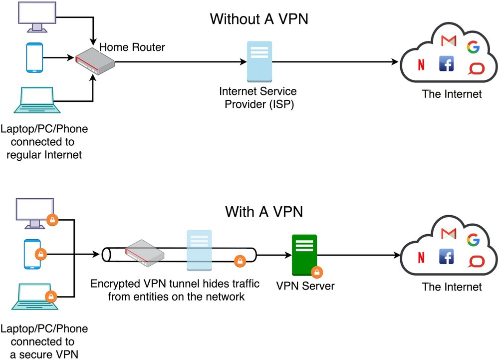

# Principles of Networking Computers 

---

## Learning Objectives

- 1.1. Identify different computer networks
 and explain their uses e.g. WAN, LAN,
 WLAN and MAN.
- 1.2. Describe how a VPN works and the
benefits they afford businesses.
- 1.3. Explain the advantages and
disadvantages of wired and wireless , e.g. security, flexibility and
BYOD (Bring Your Own Device)

---

## Identify different computer networks and explain their uses (WAN , LAN, WLAN, MAN)

- Introduce the main topics.
- Provide context for the presentation.
- Mention key points you'll discuss.

---

## Describe how a VPN works and the benefits they afford businesses

---

## Explain the advantages and disadvantages of wired and wireless networks, e.g. security, flexibility and BYOD (Bring Your Own Device) 

---

