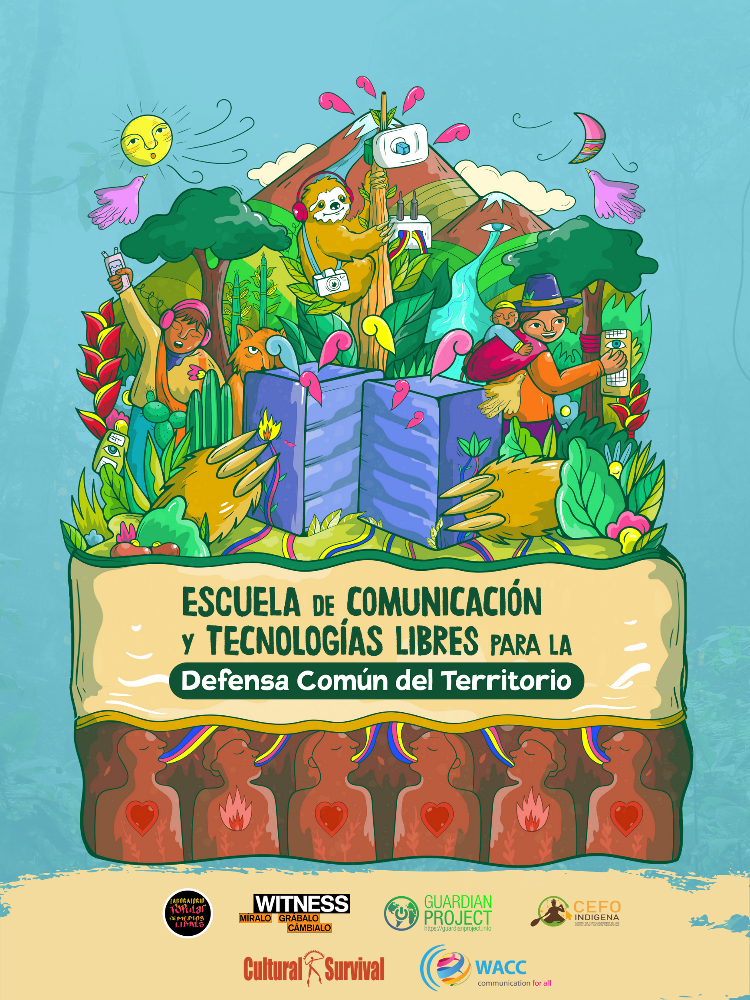
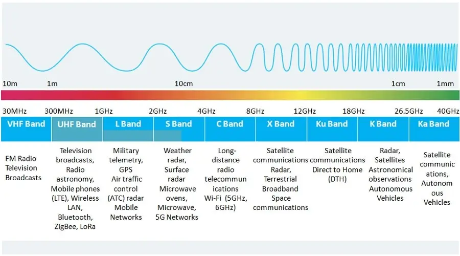

<!-- _paginate: skip -->
# Reimagining Futures 
## Creative Networks for Social Justice

---
<!-- _class: learning-objectives -->
## Learning Objectives
1 Community radios & free technologies in Latin America.

2 Introduction to LoRa

3 Radio Frequencies & Legal Considerations (UK & Latin America)

4 Scenario

5 LoRa Topologies & Network Concepts

6 Hands-on Configuration

---

## 1
#  Community radios & free technologies in Latin America.

---

- https://laboratoriodemedios.org/

  A collective dedicated to **media activism, community-based technologies, and free software**. They work on **developing independent communication networks**, digital security training, and supporting Indigenous and rural communities in reclaiming their narratives through open-source technology. They promotes **autonomous communication infrastructures** to bypass corporate-controlled platforms.

  Uses **free and open-source tools** to ensure digital sovereignty.

---

- https://escuelacomun.yanapak.org

  A **self-organized school** that provides training in **community communication, free technologies, and Indigenous knowledge-sharing**. Their work is deeply rooted in the principles of collective learning and horizontal governance. They trains Indigenous communities in **digital autonomy** and **community-based internet infrastructure**. Promotes **ancestral knowledge alongside free technology**, resisting cultural and technological colonization.

  

---

- https://red.tic-ac.org/

  A **network of community technologists** supporting Indigenous and rural organizations through **free and open-source technologies**. Their work spans across Latin America, fostering collaboration among activists, researchers, and Indigenous leaders. Strengthens **Indigenous digital sovereignty** by creating alternative internet infrastructures. Supports the development of **community-led radio, Wi-Fi networks, and independent media**.

    

---

- https://yanapak.org/

  A platform focused on **technology, Indigenous autonomy, and decolonial practices**. They provide **technical support, training, and tools** for Indigenous communities to create self-managed digital environments.

  

---

- https://milpamerica.org/

  A **political and technological movement** dedicated to the **liberation of Indigenous peoples** across Abya Yala (Latin America). They integrate **Indigenous struggles, technology, and community-based governance models** to resist capitalist and colonial forces.

---

- https://abyayala.sutty.nl/

  Red Abya Yala is a **network of activists, developers, and technologists** dedicated to making it easier for organizations and communities to **deploy autonomous and secure digital platforms**. Their primary focus is on providing **VPN services** that enable the rapid and resource-efficient setup of **web servers and secure communication infrastructures**.

---

## 🌱 Why are these organizations important for communitie?

**1️⃣ They enable digital sovereignty**: Indigenous communities develop and control their own communication networks.

**2️⃣ They resist surveillance and corporate control**: By using free and open-source technologies, these collectives protect Indigenous activists.

**3️⃣ They promote knowledge-sharing and decolonization**: These platforms empower Indigenous knowledge systems through **community-led education and technology**.

**4️⃣ They create alternative infrastructures**: Wi-Fi mesh networks, community radios, and free digital libraries allow for **self-determined communication**.

---

## 2 
# Introduction to LoRa

- **LoRa (Long Range)** is a wireless communication technology designed for long-range, low-power data transmission.
- Operates in unlicensed frequency bands (ISM bands).
- Used in IoT applications for smart cities, agriculture, industrial monitoring, etc.

---

## How LoRa Works

- Uses **chirp spread spectrum (CSS)** modulation for robust and long-distance communication.
- Low data rates but excellent penetration and range.
- Optimized for battery-operated devices.

---

## LoRa Device Components

- **Microcontroller (MCU)** – Processes data.
- **LoRa Module (RF chip)** – Handles radio communication.
- **Antenna** – Sends and receives signals.
- **Power Source** – Battery or wired power supply.

---

## Applications of LoRa

- **Smart Agriculture** – Soil moisture sensors, weather monitoring.
- **Smart Cities** – Parking sensors, environmental monitoring.
- **Industrial IoT** – Equipment monitoring, predictive maintenance.
- **Community Networks** – Decentralized communication, emergency networks.

---

## **What is Meshtastic?**

- Open-source project for **off-grid, decentralized communication**.

- Uses LoRa radios to send encrypted messages across a **mesh network**.

---

## **What is Meshtastic?**

**How It Works:**
- Each LoRa device acts as a **node** in the network.
- Messages **hop** between nodes to extend range.
- No internet required—fully **peer-to-peer**.

---

## **What is Meshtastic?**

**Key Features:**
- End-to-end encryption.
- Configurable channels and transmission power.
- Long battery life for emergency use.

---

## **What is LoRaWAN?**

**LoRaWAN vs. LoRa:**
- **LoRa**: Physical layer (radio transmission).
- **LoRaWAN**: Network protocol for managing large-scale IoT deployments.

---

## **What is LoRaWAN?**

**LoRaWAN Features:**
- Supports **many devices** in a managed system.
- Requires **gateways** to connect to the cloud.
- Used in **smart cities, agriculture, and industrial IoT**.
  
  
---
  
  
## LoRa vs. LoRaWAN
  
  | Feature       | LoRa                 | LoRaWAN                     |
  | ------------- | -------------------- | --------------------------- |
  | Protocol Type | Physical Layer       | Network Layer               |
  | Connectivity  | Point-to-point       | Star topology with gateways |
  | Applications  | Direct communication | Cloud-based IoT solutions   |
  
---
  
## 3 
# Radio Frequencies & Legal Considerations (UK & Latin America)

---

### **Understanding Radio Frequencies**

**What are radio frequencies?**
- Electromagnetic spectrum used for communication (e.g., radio, TV, Wi-Fi, LoRa).
- Measured in Hertz (Hz) and divided into frequency bands.
**Unlicensed vs. Licensed Bands**
- **Unlicensed bands** (free to use under specific power limits).
- **Licensed bands** (require government permits and regulations).

---

---

### **LoRa Frequency Bands by Region**

| **Region**    | **LoRa Frequency** | **Usage**                               |
| ------------- | ------------------ | --------------------------------------- |
| UK & Europe   | 868 MHz            | Unlicensed ISM band                     |
| Latin America | 915 MHz            | Unlicensed ISM band (in most countries) |
| USA           | 915 MHz            | Unlicensed ISM band                     |
| Africa        | Varies             | Country-dependent                       |
| Asia          | 433 MHz / 920 MHz  | Varies by country                       |

---

### **Legal Considerations**

**UK Regulations**
- Ofcom regulates spectrum usage.
- LoRa falls under ISM (Industrial, Scientific, Medical) bands, requiring low power transmission limits.
- Maximum **transmission power**: 14 dBm (25mW) for 868 MHz.

---

### **Legal Considerations**

**Latin America Regulations**
- Many countries allow 915 MHz for LoRa in ISM bands (e.g., Mexico, Argentina, Brazil).
- Some require additional permissions or lower power limits.
- In some cases, **community radio and LoRa networks face legal uncertainty** due to centralized telecom regulations.

---

### **Community Radio & LoRa Networks**

**Why are community radios important?**
- Provide **independent news and communication**.
- Serve **rural and Indigenous communities** without corporate media presence.

---

### **Community Radio & LoRa Networks**

**Can LoRa be used for radio transmission?**
- LoRa cannot transmit **audio**, but it can be used to send **text-based emergency messages** to community radio operators.
- Some projects experiment with **Internet-to-Radio bridges** to **transmit over FM radio via LoRa gateways**.

---

##  LoRa vs. Wi-Fi, Cellular, & Other Radio Networks

| Feature            | LoRa            | Wi-Fi          | Cellular          |
| ------------------ | --------------- | -------------- | ----------------- |
| Range              | 🟢 Long (10+ km) | 🔴 Short (100m) | 🟡 Medium (Few km) |
| Power Usage        | 🟢 Very Low      | 🔴 High         | 🟡 Medium          |
| Requires Internet? | 🔵 No            | 🟡 Sometimes    | 🔴 Yes             |
| Cost to Operate    | 🟢 Low           | 🟡 Medium       | 🔴 High            |

---

## LilyGO LoRa32 Characteristics & Capabilities

- **Microcontroller**: ESP32 with dual-core processor and built-in Wi-Fi/Bluetooth.

- **LoRa Module**: SX1276/SX1278 for long-range communication.

- **Frequency Support**: 868 MHz (Europe), 915 MHz (North America), 433 MHz (some regions).

- **Power Options**: Lithium battery support with built-in charging circuit.

---

## LilyGO LoRa32 Characteristics & Capabilities

- **I/O Interfaces**: Multiple GPIOs, SPI, I2C, and UART for connecting sensors.

- **Display (Optional)**: Some models include an onboard OLED screen.

- **Programming Support**: Compatible with Arduino, PlatformIO, and MicroPython.

- **Usage**: Suitable for point-to-point LoRa communication, LoRaWAN applications, and decentralized networks like Meshtastic.

- **Maximum Range**:
  - **10-15 km** in ideal conditions (line-of-sight, rural areas).
  - **1-5 km** in urban environments with obstacles and interference.

---

## 4 
  # Scenario:

  It's the year 2033. Most of the world is ruled by totalitarian regimes. Telecommunications are controlled by governments and corporations.The voices that once carried resistance have been silenced.

  Governments own the airwaves, the satellites, the networks. Every whispered word, every thought shared across a signal, is under survillance. Privacy is a crime. Even silence is suspicious.

---

  We are a small community hiding in the quiet spaces left between surveillance towers and drones. We are not many, and we have little. But we have our minds, our stories, and the will to survive in a world that wants us erased.

  We need to reach one another. To warn, to teach, to build. We need to create our own communication system. 

  We only have **these devices**.  But they are only tools. The real work is deciding how we use them.

  **How can we establish a communication system that allows us to remain connected while staying outside the control of oppressive systems?**

------

  ### **Discussion Questions:**

  1. **Network Topology**

     - Do we build a **centralized** system: one stronghold, one access point, easy to organize but vulnerable to attack?

     - Or do we weave a **decentralized** mesh: each of us a node, harder to find, harder to destroy?

     - How do we choose? How do we survive?

---

  ### **Discussion Questions:**

  2. **Roles in the Community**

     - Who is responsible for maintaining the network,keeps it alive, fixes what breaks?
     - Who teaches the young, ensures that knowledge is passed and not lost?
     - How do we keep our communication alive without creating a hierarchy that can be corrupted?

---

  ### **Discussion Questions:**

  3. **Security & Anonymity**

     - How do we balance trust and protection?
     - Should we implement authentication systems to ensure only trusted members can access the network?

     

  

---

## 5 
# LoRa Topologies & Network Concepts

------

## **🌐 LoRa Network Topologies: Understanding How We Communicate**

In this experiment, we will create **two different network topologies** using **LilyGO LoRa32** devices to explore how off-grid communication works.

---

### **1️⃣ Peer-to-Peer (P2P) Mesh Network**

**🔗 How it Works:**

- Multiple **LoRa nodes** are connected within the **Meshtastic network**.
- Each node **communicates directly** with others within range.
- Messages can **hop** between nodes to **extend communication range**.
- The network is **fully decentralized**—no central authority or access point is needed.

---

### **1️⃣ Peer-to-Peer (P2P) Mesh Network**

**Key Characteristics:**

**✅ No central coordination**—each device is both sender and relay.

**✅ End-to-end encrypted communication**.

**✅ Good for emergency use** when centralized networks fail.

**📌 Real-World Example:** Used in **protest movements, disaster response, and remote communities** where traditional internet or cellular services are unavailable.

------

### **2️⃣ LoRa Access Point (AP) Network with Broadcast Transmission**

**📡 How it Works:**

- Three **LoRa devices act as Access Points (APs)**, creating a **backbone network**.
- The APs communicate via **broadcast messages**, relaying data across the system.
- Other devices (e.g., smartphones, computers) **connect to the APs** to access the network.
- Devices can **send messages to each other through the AP infrastructure**.

---

### **2️⃣ LoRa Access Point (AP) Network with Broadcast Transmission**

**Key Characteristics:**

**✅ Supports multiple users via centralized APs**.

**✅ Devices do not need direct LoRa connections—they connect through APs**.

**✅ Easier integration with existing Wi-Fi devices** (e.g., sending LoRa messages from a phone).

**📌 Real-World Example:** Used in **community radio projects, local messaging networks, and sensor-based IoT applications**.

------

## **💡 Basic Networking Concepts to Understand These Topologies**

**Nodes & Hops**

- **Node**: Any device in the network (LoRa module, phone, etc.).
- **Hop**: When a message travels from one node to another, extending its reach.

---

### **Decentralized vs. Centralized Networks**

| **Feature**     | **Peer-to-Peer (P2P)**                | **Access Point (AP) Network**  |
| --------------- | ------------------------------------- | ------------------------------ |
| **Structure**   | Fully decentralized                   | Central APs manage the network |
| **Reliability** | Can work without power infrastructure | Depends on APs staying online  |
| **Scalability** | Expands with more nodes               | Limited to AP coverage         |

---

### **Broadcast vs. Direct Communication**

- **Broadcast**: Messages are sent to all nodes (useful for announcements or emergency alerts).
- **Direct Communication**: Messages are sent to a specific node only (ensures privacy but requires routing).

------

### **🔍 Which Topology is Best?**

- **P2P Mesh:** Best for fully **off-grid communication** with no reliance on infrastructure.

- **AP Network:** Best for **structured communication**, allowing integration with phones and computers.

---

## 6 
# Hands-on Configuration 
## Setting Up LoRa Mesh Network

## [Instructions](https://ctp.cc.au.dk/pad/p/LoRa_Workshop_Documentation)

---

**Split into Two Teams:**
  1. **Access Point Group (LoRa Wi-Fi Bridge):**
     - Configure LilyGO as an access point
     - Enable WebSockets for message transfer
     - Adjust Wi-Fi settings
  2. **Peer-to-Peer (Meshtastic Mesh Network):**
     - Install & connect Meshtastic
     - Configure encryption, channels
     - Test mesh routing & range

---

  ## Field Testing & Experimentation

  - Understanding LoRa network performance in real-world conditions.
  - Testing range, message reliability, and latency.
  - Optimizing network settings based on results.

---

  ## Measuring Message Delivery Time

  - **Step 1:** One participant sends a message.
  - **Step 2:** Another participant waits at a designated location.
  - **Step 3:** Use a **stopwatch** or check timestamps in **Meshtastic**.
  - **Step 4:** Compare response times at different distances (e.g., 50m, 100m, 500m).

---

  ## Comparing Open Areas vs. Urban Environments

  - **Test in different locations:**
    - Open fields (e.g., parks, rural areas).
    - Dense urban spaces (e.g., between buildings, city streets).
  - **Record findings:**
    - Message delivery success rates.
    - Impact of obstacles (walls, trees, people, traffic).
    - Maximum communication range before failure.

---

  ## Measuring Message Loss Rates

  - **Step 1:** Send **10 test messages** at different distances.

  - **Step 2:** Count how many were successfully received.

---

  ## Adjusting LoRa Settings for Better Performance

  - Modify **Spreading Factor (SF)** to improve range.
  - Increase **Transmission Power (Tx)** for better coverage.

---

  ## Logging Results & Improving Network Design

  - Record test results in a shared document.
  - Map successful message reception points.

---

  ## Group Discussion & Next Steps

  - Share findings from field tests.
  - Apply learnings to community-driven LoRa networks.
  - Imagine different real-world applications.

